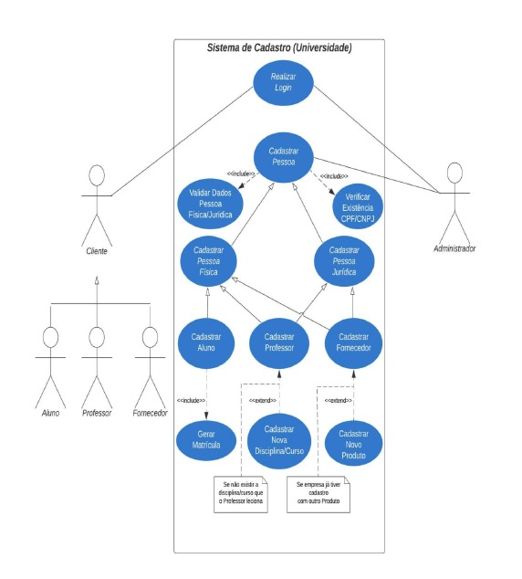
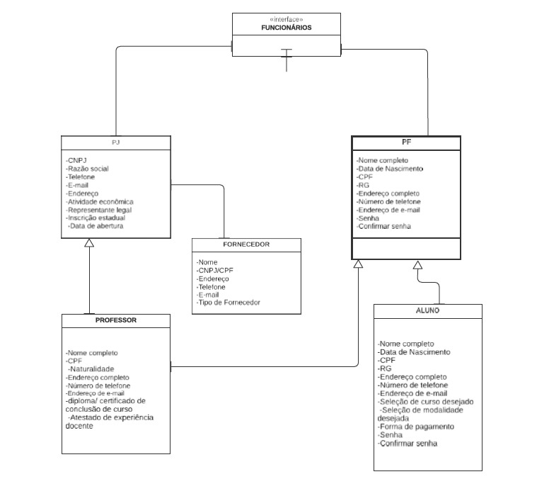

# Projeto Integrador III: Desenvolvimento de Sistemas Orientado a  Objetos

## Requisitos Funcionais:
 #### Cadastro de Pessoa Física:
- Cadastro de dados como nome, CPF, RG, endereço e telefone.
- Validação de informações (formato de e-mail, senha confirmada).
- Envio de e-mail para ativação da conta. 
 #### Cadastro de Pessoa Jurídica:
- Registro de empresas com informações como CNPJ, razão social, endereço, e representante legal.
- Validação e feedback para correção de dados incorretos.
 #### Cadastro de Aluno:
- Inscrição em cursos (presenciais ou EAD), com opções de pagamento.
- Validação de dados e confirmação de inscrição por e-mail.
 
 #### Cadastro de Professor:
- Cadastro de colaboradores docentes com dados pessoais e documentos como diploma e comprovantes de experiência.
- Validação de senha com requisitos específicos.
 
 #### Cadastro de Fornecedores:
- Gerenciamento de fornecedores de materiais ou serviços, incluindo informações financeiras opcionais.
- Disponibilidade para processos administrativos após o cadastro.

## Diagrama de Caso de Uso

## Diagrama de Classe

